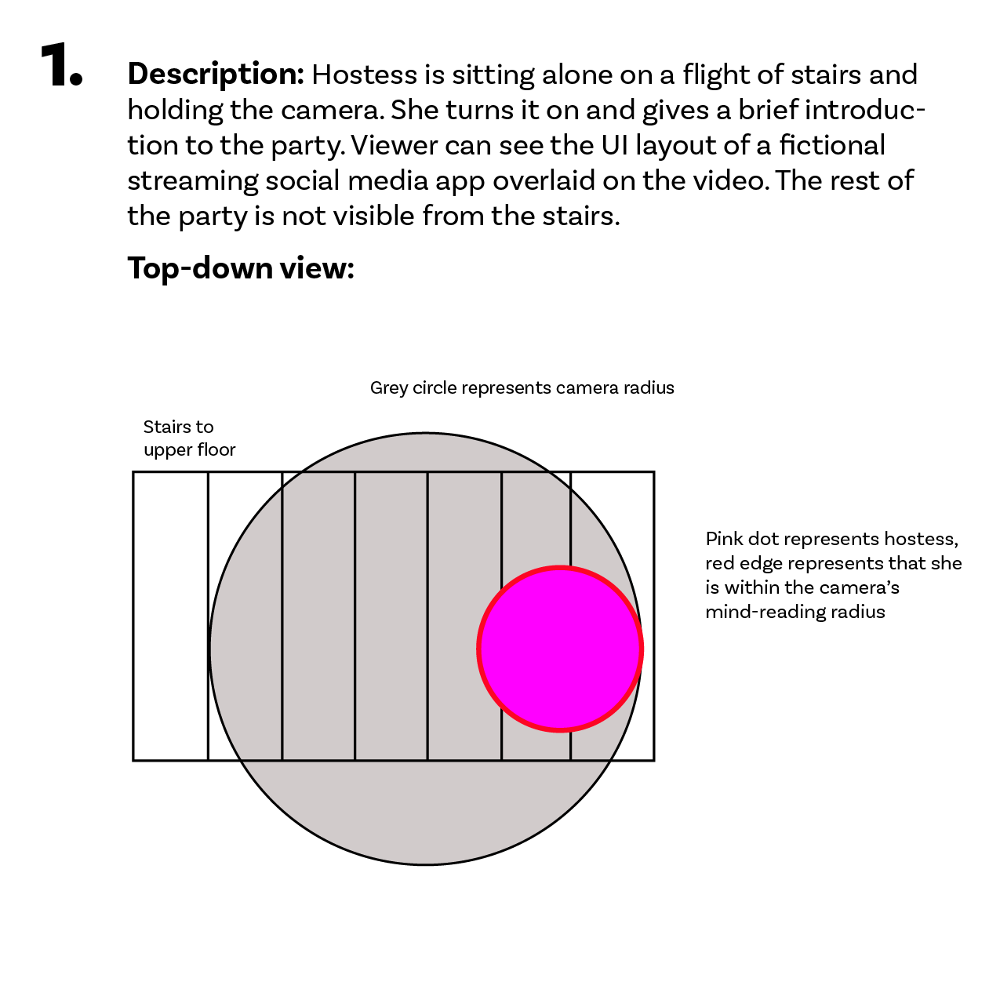
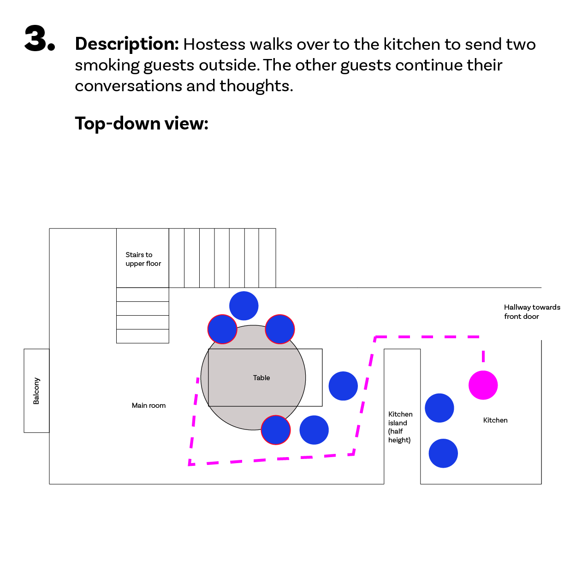
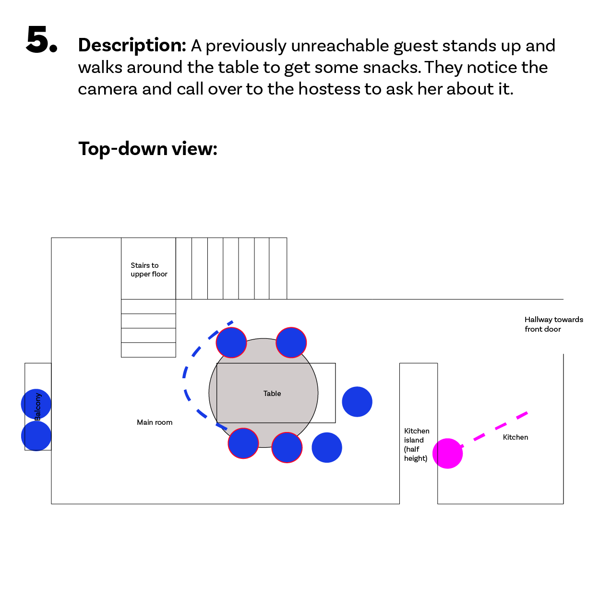
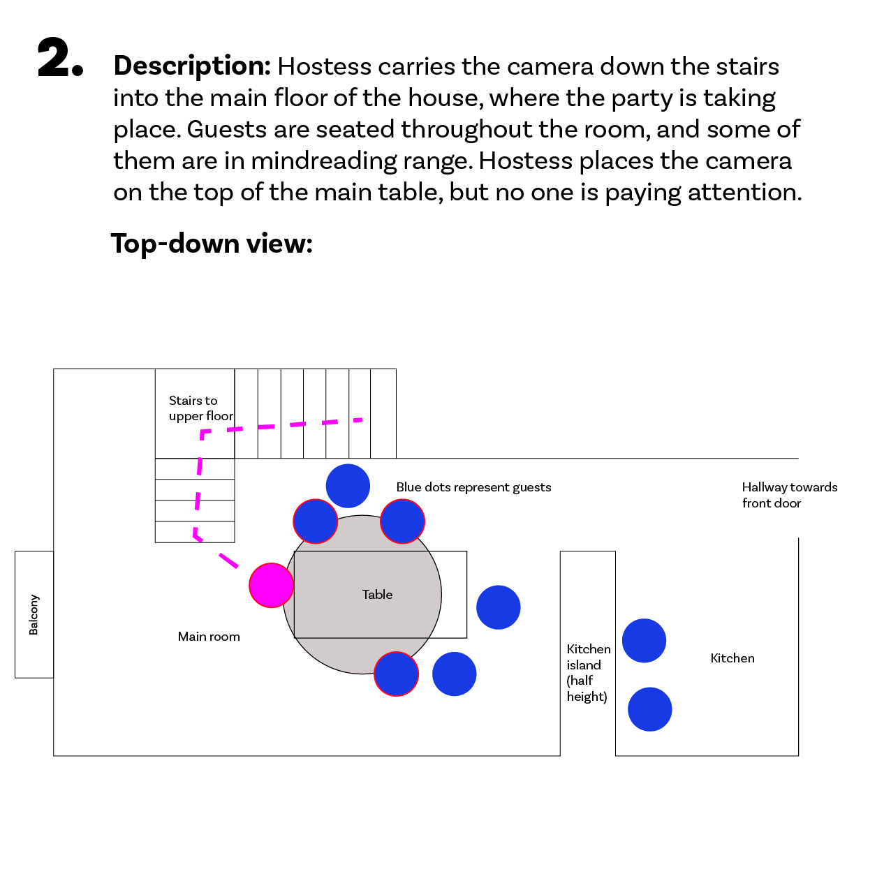
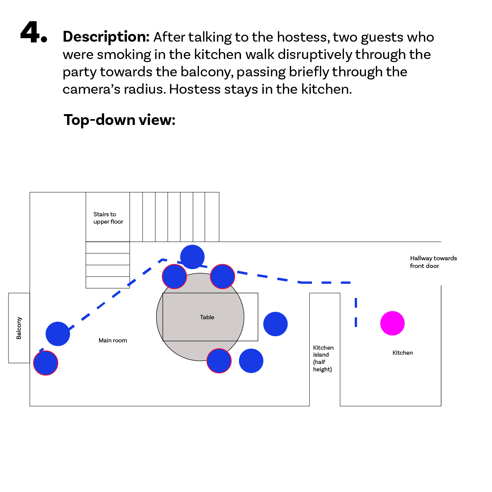

# Haptic Motifs Progress Post 4

*December 1, 2019: Proposal (Slightly Less) Rough Draft*

**Obligatory TL;DR:** Rather than fearing FOMO in cinematic virtual reality, I want to take advantage of it for story engagement and immersion. I plan to do this by shooting a short 360* film with far more going on in the scene than the user can take in. To provide meaningful choices from this overwhelming cinematography, I will provide the user with a special device to inform them about all of the points of interest in the scene around them, through tactile (vibrational) feedback. I want to investigate the effectiveness of this approach through user testing. I have a lot to figure out if I’m actually going to make this happen.

## Project Overview
By next May, I plan to execute a project which will explore the concept of multiple points of interest (POIs) in cinematic virtual reality (CVR) scenes from both artistic and research-oriented perspectives.

The artistic component will involve designing, shooting, and editing together a CVR experience about a group of college students who have a supernatural experience at a house party. The story will focus on fear of missing out (FOMO), which features heavily both in my generation’s social contexts and in theory about narrative design for CVR. This theme will be reflected both in the challenges the characters face in the story, and in the choreography of the scenes, which will violate CVR best practices and have an overwhelming number of POIs. This is often advised against, because it can detract from the user’s presence. However, I’m curious if FOMO can be utilized intentionally to increase presence, so I plan to balance this complexity with a powerful and engaging mechanic. The user will have the ability to select specific characters in the scene, one at a time, and listen to their inner dialogue to gain more information about the story.

The technical component will involve designing and building a special controller to provide tactile feedback about the locations of POIs in the scene. This controller will have the form factor of a headband, bracelet, or other device that can convey 360* of information about the scene. It will dynamically update itself as the user turns their head to vibrate in the directions of POIs.

A major part of my interest in developing these components is a desire to back them up with user research. As described in previous posts on this blog, I want to run user testing on this CVR experience to study whether my controller successfully indicates POIs in the scene, and whether my FOMO-oriented choreography and cinematography successfully increase presence in the scene. I hope to publish a research paper with the results in 2020, and carry them forward into my future research.

## Narrative Design
### Story
You find yourself in the middle of a house party full of people you don’t know. As if that isn’t bad enough, they’re having an argument about you. It’s 2024, and streaming events in virtual reality has become a popular social media trend… however, some of the guests at this party have their own motivations for not wanting the camera on. In the middle of this, you discover that you have the inexplicable ability to read the thoughts of anyone who comes close enough to the camera.

And then, as if the situation wasn’t tense enough, two guests run in from the balcony, shouting that they just saw a ghost walking down the sidewalk…

This story will follow the night of a college student who is consumed by FOMO and appearances while hosting and streaming a party. She hopes that mimicking the streams of popular parties she’s seen will make her more popular, but is so focused on the appearance of the stream that she isn’t actually participating in the party. When her conflict with some guests who don’t approve of the stream is interrupted by a supernatural event, her focus remains on how the events will affect her stream. Only when one of her friends directly confronts her about her behavior does she realize that her fear of missing out has been self-reinforcing.

The user will experience all of this from the perspective of the hostess’ 360* camera. Their video will have an overlay of a social media streaming platform. They will initially think that they must be one of the hostess’ friends, remotely watching her stream. However, as the story progresses and the user learns more information by listening to characters’ thoughts, they will begin to doubt this identity, wondering if they represent some sinister force hacking into the stream or even the cause of the supernatural disturbance. The hostess’ story will be resolved at the end of the film, but the user’s story will remain open-ended.

### Plot Points
* Hostess turns her camera on and gives a practiced introduction to the stream.
* Hostess carries the camera into her living room and, unnoticed by her guests, places it on a table.
* Hostess leaves the living room to send two guests who are smoking in her kitchen out to the balcony. This gives the user a chance to listen to other characters’ thoughts and conversations.
* After a minute, the hostess returns and does something that draws the attention of the room to the camera.
* An argument breaks out over the camera: whether the streaming platform is secure, and whether streaming a party violates guests’ privacy.
* The two guests who were smoking on the balcony interrupt the argument by running inside, describing a supernatural event that they saw on the street.
* Everyone runs over to the balcony to look. The street appears empty. The hostess aggressively pushes to the front with the camera, attempting to capture the event.
* Several guests, including the hostess and her camera, go out into the street to look around. The others remain in the house.
* The group can’t find anything in the street, to the hostess’ increased frustration. Several of them walk farther down the street to investigate, leaving the hostess and another friend under a streetlight in front of the house to wait.
* The hostess and her friend have a heart-to-heart on the street about the hostess’ behavior. They’re so focused on the moment that they don’t even notice when the supernatural occurrence appears behind them. However, their friends who remained in the house see it through the window and try to get their attention.
* The other people run back up the street, but the occurrence disappears. All go back into the house. In the living room, their conversation returns to what they just saw and who might have been watching the stream.
* Throughout all of this, the inner thoughts of guests and the hostess will provide more context and clues about the storyworld, events, and potential identity of the user.

### Storyboarding Example
In the images below, I’ve done some rough storyboarding (more like choreography) of the first few plot points. The diagrams represent top-down views of the shots (based on the layout of my apartment, where I assume this will be taking place.) The pink dot is the hostess, and the blue dots are guests. The grey circle represents the “mind-reading radius” of the camera, and dots with red borders are within the mind-reading radius. Therefore, their thoughts can be listened to if they are selected by the user.

I’ll be completing more storyboards like this, and potentially storyboards from other perspectives, over the next month. In addition, I’ll be writing out an official script.

## Interaction and Research Design
I have one big objective for the interaction design of this experience: to give the user a chance of engaging with the highly overwhelming narrative design.

Cinematic VR and 360* video is a “lean-in” media experience (Vosmeer and Schouten), with related design challenges. Viewers generally expect more interaction and engagement here than when watching traditional “lean-back” video content. However... on the other hand, game-like experiences with objectives can involve more “lean-forward” active decision-making than viewers particularly want (Ana Rita Jesus Costa.)

In this experience, I want to balance those pressures by providing the user with meaningful choices that don’t affect the progression of the story. By including more “secret” information than the user can take in at once, I want to create an overwhelming scene that also provides the user with interesting options. Either they can choose to explore the inner thoughts of specific characters, or they can choose to simply take in the scene as shot. Hopefully, this will result in an engaging, rich, and customizable experience.

The success of this approach is going to depend on my attention guiding techniques. Attention guiding is an open issue in CVR because of the user’s freedom to look anywhere in the scene, potentially missing POIs around them. Shots as we think of them in traditional video don’t really exist! Attention guiding techniques are vastly diverse, but I’ve noticed that many of them focus on visual and auditory, rather than tactile, cues. However, I have a hunch that tactile (vibration) feedback could be a highly effective way of providing information about the locations of multiple POIs around the user. It’s challenging to design cues for these situations that are effective, subtle, and not overwhelming, and little research has been done on the potential of tactile feedback (Rothe, Buschek, Hubmann.)

The device I build to convey information about the locations of POIs around a circle will probably need to be circular itself. My current thought is to build a headband, collar, or bracelet with small vibrating elements embedded throughout it. These elements will be updated by a microcontroller controlled by a game engine keeping track of the user’s current direction of view and the current locations of POIs. As the user turns their head, these will update in real time.

*Sketches of headband from front and back, bracelet*

While everything I’ve described up to this point is my most concrete and actionable plan yet, I’m still left with…

## An Overwhelming Pile of Questions
* What existing research is out there on how effective tactile feedback is at delivering information? What about in VR?
* What about existing research for attention guiding with multiple POIs?
* Or about existing game studies research about player satisfaction when making story-oriented choices?
* How can I best adapt existing presence questionnaires to investigate this situation?
* Are there better ways I could arrange POIs in a scene to test these research questions?
* How many POIs should I test at once in these scenes?
* How can I best work with my actors to prepare them for this shoot? What new challenges will they be presented with by a 360* camera?
* Does this film need to be a single five-minute shot, or could I break it up in ways that don’t affect presence? How can I make walking with the camera comfortable and not nauseating?
* Is the camera I currently have going to be able to do the job?
* How can I add a “supernatural event” to the video in an even vaguely credible way?
* Is it going to be too computationally intensive to render so much spatial audio and update spatial feedback on the headband in real time?
* Is Unity the best choice for controlling this? If so, how best can I pass information between Unity and a microcontroller?
* What would it look like to work with vibrating elements so small they could fit into a headband? How should I fabricate this?
* Do I want users to be given the headband AND traditional controllers? How will they select the characters they want to listen to?
* What VR hardware would it make the most sense to design this for?
* Wow, thank you so much for reading this all the way through! Please let me know if you have any feedback or ideas. I’ll keep updating this blog with my plans as they progress. 
