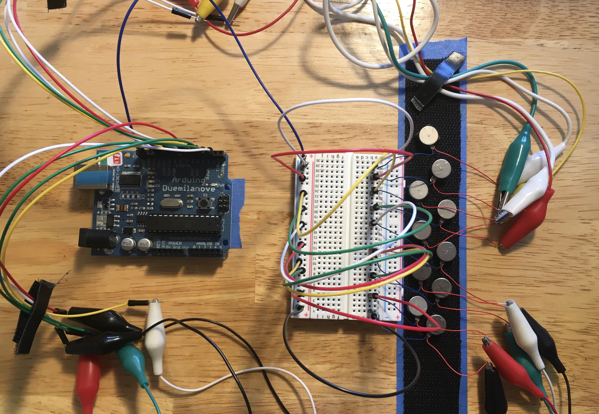
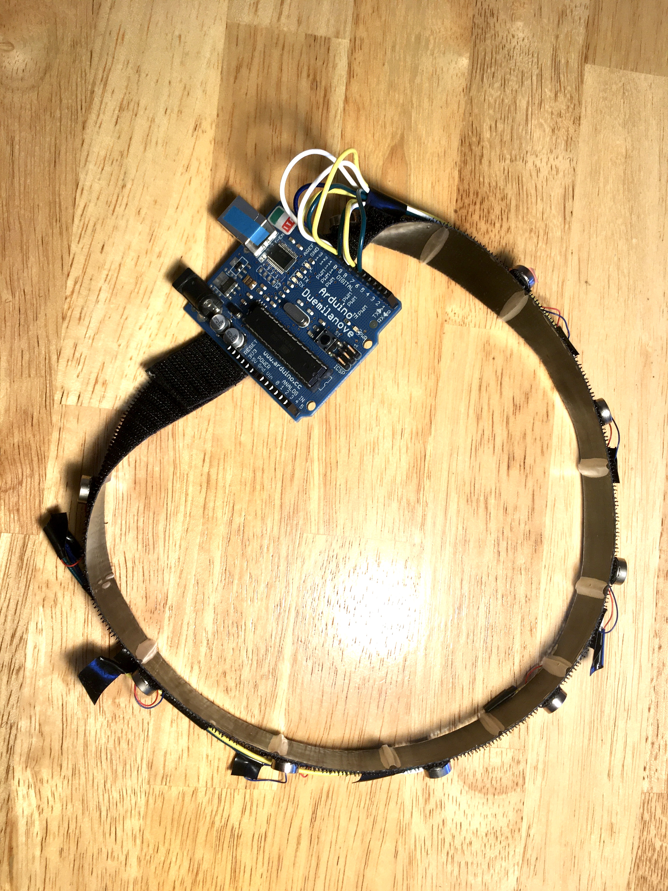
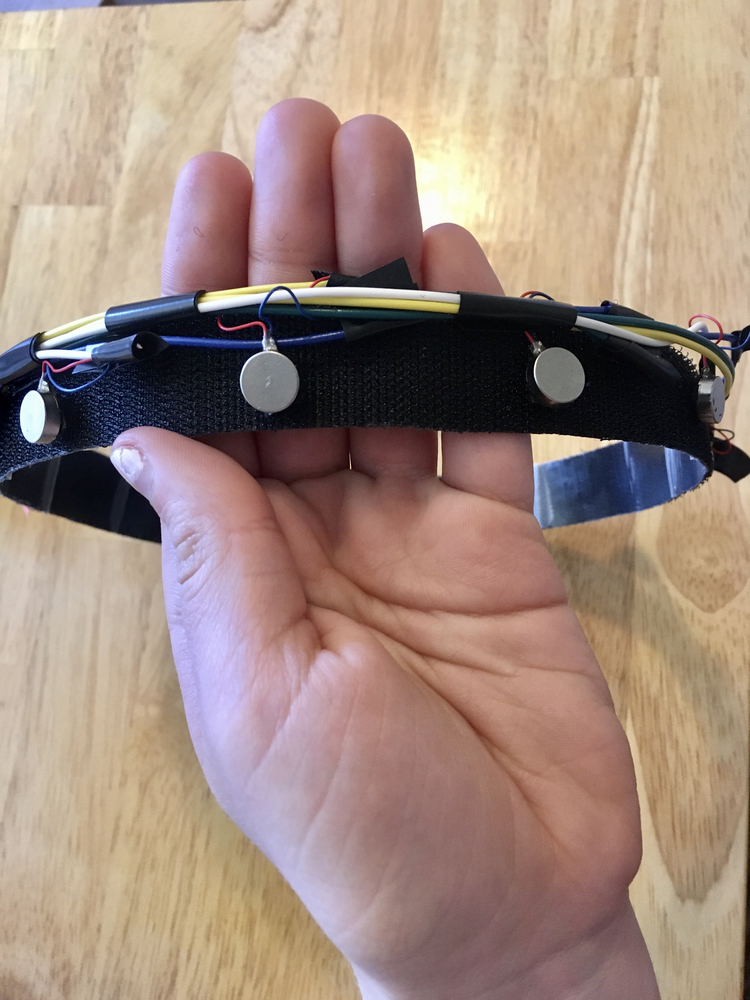

# Haptic Motifs Progress Post 6

*April 7, 2020: Headband prototype and initial prototype code*

## Headband Prototype
In this update, I started the development of the headband itself (better late than never!) and looked into sensation and perception on the surface of the head.

The headband prototype consists of nine motors wired to an Arduino, secured to the surface of a headband with Velcro tape. The Arduino is connected to my laptop with a long USB cord, for power and serial data.

While my original thought with the Velcro was to make the motors easy to rearrange, that would involve 20 unsecured wires floating around the headband, which didn’t seem worth it. Instead, each motor has a range of two inches along the surface of the band. This will allow testing with some small clusters of motors.

Prototype circuit:

*There was a LOT of soldering and wire cutting in my future at this point.*

The final headband:

*“So what did you do in quarantine?” “Well…”*

Right now I’m writing code for some little tests of how different combinations of active motors feel to my head. I’m most interested in how different animations and combinations of non-neighboring motors feel.

void testAnimations(){

  //1. across forehead

   digitalWrite(7, HIGH);
   delay(100);
   digitalWrite(8, HIGH);
   digitalWrite(7, LOW);
   delay(100);
   digitalWrite(9, HIGH);
   digitalWrite(8, LOW);
   delay(100);
   digitalWrite(9, LOW);

   delay(1000);

  //2. front to back

  digitalWrite(7, HIGH);
   delay(100);
   digitalWrite(6, HIGH);
   digitalWrite(7, LOW);
   delay(100);
   digitalWrite(5, HIGH);
   digitalWrite(6, LOW);
   delay(100);
   digitalWrite(5, LOW);

   delay(1000);

  //3. back to front

  digitalWrite(5, HIGH);
   delay(100);
   digitalWrite(6, HIGH);
   digitalWrite(5, LOW);
   delay(100);
   digitalWrite(7, HIGH);
   digitalWrite(6, LOW);
   delay(100);
   digitalWrite(7, LOW);

   delay(5000);
}

void testCombos() {

  //1. Can I distinguish front-back combos of 2 simultaneous motors?

  digitalWrite(9, HIGH);
  digitalWrite(13, HIGH);
  delay(300);
  digitalWrite(9, LOW);
  digitalWrite(13, LOW);

  delay(1000);
  
  //2. Can I distinguish left-right combos of 2 simultaneous motors?

  digitalWrite(7, HIGH);
  digitalWrite(11, HIGH);
  delay(300);
  digitalWrite(7, LOW);
  digitalWrite(11, LOW);

  delay(1000);

  //3. What about combos where both are on one side?

  digitalWrite(5, HIGH);
  digitalWrite(7, HIGH);
  delay(300);
  digitalWrite(7, LOW);
  digitalWrite(5, LOW);

  delay(1000);

  //4. What about combos of 3? front, left back, right back?

  digitalWrite(5, HIGH);
  digitalWrite(8, HIGH);
  digitalWrite(11, HIGH);
  delay(300);
  digitalWrite(8, LOW);
  digitalWrite(5, LOW);
  digitalWrite(11, LOW);

  delay(1000);

  //5. or 4?

  digitalWrite(5, HIGH);
  digitalWrite(7, HIGH);
  digitalWrite(9, HIGH);
  digitalWrite(11, HIGH);
  delay(300);
  digitalWrite(9, LOW);
  digitalWrite(5, LOW);
  digitalWrite(7, LOW);
  digitalWrite(11, LOW);

  delay(5000);
}

void testAllMotors (){

  Serial.println("click clack buzz!");

  digitalWrite(5, HIGH);
  delay(200);
  digitalWrite(5, LOW);
  delay(200);
  digitalWrite(6, HIGH);
  delay(200);
  digitalWrite(6, LOW);
  delay(1000);
  digitalWrite(7, HIGH);
  delay(200);
  digitalWrite(7, LOW);
  delay(1000);
  digitalWrite(8, HIGH);
  delay(200);
  digitalWrite(8, LOW);
  delay(1000);
  digitalWrite(9, HIGH);
  delay(200);
  digitalWrite(9, LOW);
  delay(1000);
  digitalWrite(10, HIGH);
  delay(200);
  digitalWrite(10, LOW);
  delay(1000);
  digitalWrite(11, HIGH);
  delay(200);
  digitalWrite(11, LOW);
  delay(1000);
  digitalWrite(12, HIGH);
  delay(200);
  digitalWrite(12, LOW);
  delay(1000);
  digitalWrite(13, HIGH);
  delay(200);
  digitalWrite(13, LOW);
  delay(5000);
}

As for research, I struggled this week to find a diagram or paper describing sensitivity and tactile perception across the surface of the head. Perhaps I’m missing the right search terms.
